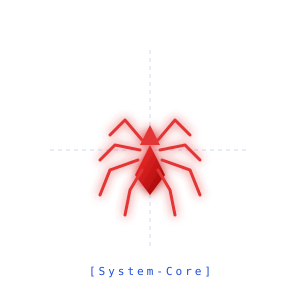

 

# <h1 style="color: #ff3333;"><code>G H I I D E V</code></h1>

### <code style="color: #3b82f6;"> >_ SYSTEMS & APPLICATION ENGINEERING </code>

<em>Crafting robust systems. Arch Linux native.</em>

 

### ■ THE STACK

<kbd> Rust </kbd> &nbsp;┼&nbsp; <kbd> Java </kbd> &nbsp;┼&nbsp; <kbd> Python </kbd> &nbsp;┼&nbsp; <kbd> Git </kbd> &nbsp;┼&nbsp; <kbd> Arch Linux </kbd>

 

### ■ SYSTEM CORE

 

### ■ OPERATING PRINCIPLES

 

> **01. Control:** Command line over GUI. Arch Linux as the absolute foundation.
> 
> **02. Performance:** Rust for systems that cannot fail or waste milliseconds.
> 
> **03. Scale:** Java for architecting robust and predictably maintainable backends.
> 
> **04. Agility:** Python for rapid prototyping, seamless automation, and scripting.
> 
> **05. History:** Git is not a backup; it is the precise narrative of engineering decisions.

 

<a href="https://git.io/typing-svg">
  <picture>
    <source media="(prefers-color-scheme: dark)" srcset="https://readme-typing-svg.demolab.com?font=Fira+Code&weight=500&size=15&pause=1000&color=FF3333&center=true&vCenter=true&width=450&lines=%3E_+sudo+pacman+-Syu...;%3E_+cargo+build+--release...;%3E_+system+status:+optimal;%3E_+spider-sense:+active...;%3E_+EOF">
    <source media="(preprs-color-scheme: light)" srcset="https://readme-typing-svg.demolab.com?font=Fira+Code&weight=500&size=15&pause=1000&color=2563EB&center=true&vCenter=true&width=450&lines=%3E_+sudo+pacman+-Syu...;%3E_+cargo+build+--release...;%3E_+system+status:+optimal;%3E_+spider-sense:+active...;%3E_+EOF">
    
  </picture>
</a>

